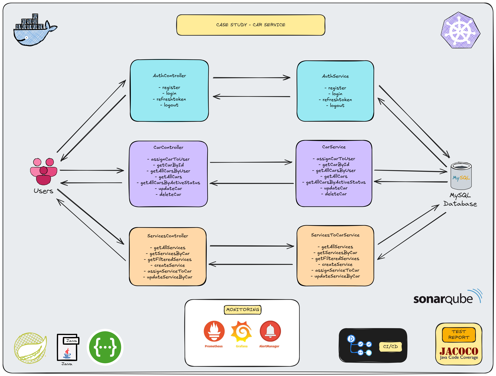
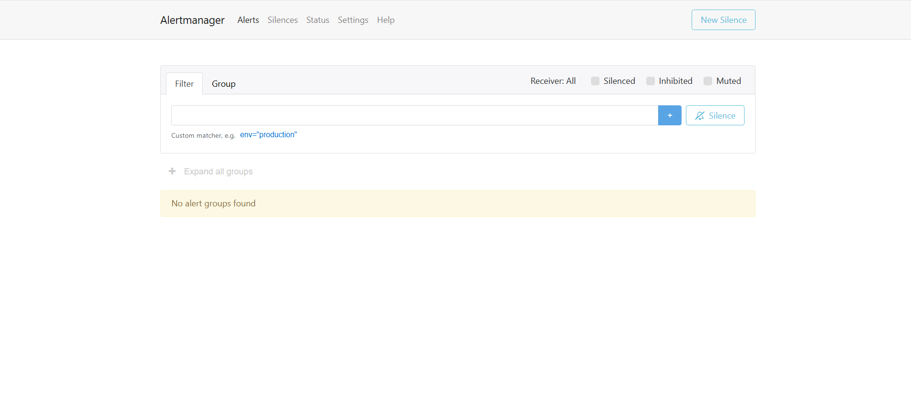
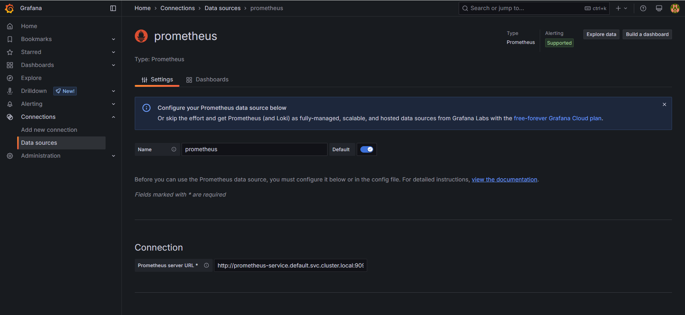

# Case Study - Car Service

<p align="center">
    
</p>

### 📖 Information

### 📖 Information

<ul style="list-style-type:disc">
  <li>
    <b>Authentication:</b>
    <ul>
      <li>Users must register before accessing car and service endpoints.</li>
      <li>Login returns an access + refresh token; refresh-token endpoint issues new tokens.</li>
      <li>Logout invalidates the refresh token.</li>
      <li>Responses use HTTP‑status codes: 200 for success, 400 for bad data, 401 for unauthorized, 409 for conflicts.</li>
    </ul>
  </li>
  <li>
    <b>Car Management:</b>
    <ul>
      <li>Roles “USER” or “ADMIN” can assign cars; only admins can list/update/delete any car.</li>
      <li>Each car has a unique license plate; duplicates yield 409 Conflict.</li>
      <li>Owners (and admins) can retrieve, update, or soft‑delete by ID.</li>
      <li>Admin‐only endpoints support pagination and filtering by “active” status.</li>
    </ul>
  </li>
  <li>
    <b>Service Management:</b>
    <ul>
      <li>Only admins may create, assign, or update services.</li>
      <li>Services can be listed (all, by car, or filtered by status), with pagination on every list endpoint.</li>
      <li>Assigning a service to a car or updating it returns the updated ServiceResponse.</li>
    </ul>
  </li>
</ul>


### Explore Rest APIs

Endpoints Summary
<table style="width:100%;">
    <tr>
        <th>Method</th>
        <th>Url</th>
        <th>Description</th>
        <th>Request Body</th>
        <th>Path Variable</th>
        <th>Response</th>
    </tr>
    <tr>
        <td>POST</td>
        <td>/api/v1/authentication/user/register</td>
        <td>Register for Admin or User</td>
        <td>RegisterRequest</td>
        <td></td>
        <td>CustomResponse&lt;Void&gt;</td>
    </tr>
    <tr>
        <td>POST</td>
        <td>/api/v1/authentication/user/login</td>
        <td>Login for Admin or User</td>
        <td>LoginRequest</td>
        <td></td>
        <td>CustomResponse&lt;TokenResponse&gt;</td>
    </tr>
    <tr>
        <td>POST</td>
        <td>/api/v1/authentication/user/refresh-token</td>
        <td>Refresh Token for Admin or User</td>
        <td>TokenRefreshRequest</td>
        <td></td>
        <td>CustomResponse&lt;TokenResponse&gt;</td>
    </tr>
    <tr>
        <td>POST</td>
        <td>/api/v1/authentication/user/logout</td>
        <td>Logout for Admin or User</td>
        <td>TokenInvalidateRequest</td>
        <td></td>
        <td>CustomResponse&lt;Void&gt;</td>
    </tr>
    <tr>
        <td>POST</td>
        <td>/api/v1/cars</td>
        <td>Assign a new car to a user</td>
        <td>CreateCarRequest</td>
        <td></td>
        <td>CustomResponse&lt;CarResponse&gt;</td>
    </tr>
    <tr>
        <td>GET</td>
        <td>/api/v1/cars/{carId}</td>
        <td>Get car by ID</td>
        <td></td>
        <td>carId (UUID)</td>
        <td>CustomResponse&lt;CarResponse&gt;</td>
    </tr>
    <tr>
        <td>POST</td>
        <td>/api/v1/cars/users/{userId}</td>
        <td>Get all cars for a user</td>
        <td>CustomPagingRequest</td>
        <td>userId (UUID)</td>
        <td>CustomResponse&lt;CustomPagingResponse&lt;CarResponse&gt;&gt;</td>
    </tr>
    <tr>
        <td>POST</td>
        <td>/api/v1/cars/all</td>
        <td>Get all cars (admin)</td>
        <td>CustomPagingRequest</td>
        <td></td>
        <td>CustomResponse&lt;CustomPagingResponse&lt;CarResponse&gt;&gt;</td>
    </tr>
    <tr>
        <td>POST</td>
        <td>/api/v1/cars/allcarsByActiveStatus</td>
        <td>Get all active cars (admin)</td>
        <td>CustomPagingRequest</td>
        <td></td>
        <td>CustomResponse&lt;CustomPagingResponse&lt;CarResponse&gt;&gt;</td>
    </tr>
    <tr>
        <td>PUT</td>
        <td>/api/v1/cars/{carId}</td>
        <td>Update car by ID</td>
        <td>UpdateCarRequest</td>
        <td>carId (UUID)</td>
        <td>CustomResponse&lt;CarResponse&gt;</td>
    </tr>
    <tr>
        <td>DELETE</td>
        <td>/api/v1/cars/{carId}</td>
        <td>Soft delete car by ID (admin)</td>
        <td></td>
        <td>carId (UUID)</td>
        <td>CustomResponse&lt;String&gt;</td>
    </tr>
    <tr>
        <td>POST</td>
        <td>/api/services/all</td>
        <td>Get all services (admin)</td>
        <td>CustomPagingRequest</td>
        <td></td>
        <td>CustomResponse&lt;CustomPagingResponse&lt;ServiceResponse&gt;&gt;</td>
    </tr>
    <tr>
        <td>POST</td>
        <td>/api/services/car/{carId}</td>
        <td>Get services by car ID (admin)</td>
        <td>CustomPagingRequest</td>
        <td>carId (UUID)</td>
        <td>CustomResponse&lt;CustomPagingResponse&lt;ServiceResponse&gt;&gt;</td>
    </tr>
    <tr>
        <td>POST</td>
        <td>/api/services/filter</td>
        <td>Filter services by car/status (admin)</td>
        <td>FilterServicePagingRequest</td>
        <td></td>
        <td>CustomResponse&lt;CustomPagingResponse&lt;ServiceResponse&gt;&gt;</td>
    </tr>
    <tr>
        <td>POST</td>
        <td>/api/services</td>
        <td>Create a new service (admin)</td>
        <td>CreateServiceRequest</td>
        <td></td>
        <td>CustomResponse&lt;ServiceResponse&gt;</td>
    </tr>
    <tr>
        <td>POST</td>
        <td>/api/services/assign</td>
        <td>Assign service to car (admin)</td>
        <td>AssignServiceToCarRequest</td>
        <td></td>
        <td>CustomResponse&lt;ServiceResponse&gt;</td>
    </tr>
    <tr>
      <td>PUT</td>
      <td>/api/services/car/{carId}/service/{serviceId}</td>
      <td>Update service on car (admin)</td>
      <td>UpdateServiceRequest</td>
      <td>carId, serviceId (UUID)</td>
      <td>CustomResponse&lt;ServiceResponse&gt;</td>
    </tr>
</table>


### Technologies

---
- Java 21
- Spring Boot 3.0
- Restful API
- Open Api (Swagger)
- Maven
- Junit5
- Mockito
- Integration Tests
- Docker
- Docker Compose
- CI/CD (Github Actions)
- Postman
- Prometheus
- Grafana
- Alert Manager
- Sonarqube
- Kubernetes
- JaCoCo (Test Report)

### Postman

```
Import postman collection under postman_collection folder
```


### Prerequisites

#### Define Variable in .env file

```
CAR_SERVICE_DB_IP=localhost
CAR_SERVICE_DB_PORT=3306
DATABASE_USERNAME={MY_SQL_DATABASE_USERNAME}
DATABASE_PASSWORD={MY_SQL_DATABASE_PASSWORD}

GF_SMTP_ENABLED=true
GF_SMTP_HOST=smtp.gmail.com:587
GF_SMTP_USER={your_gmail_email}
GF_SMTP_PASSWORD={gmail_authentication_password}
GF_SMTP_SKIP_VERIFY=true
GF_SMTP_FROM_ADDRESS={your_gmail_email}


ALERT_RESOLVE_TIMEOUT=5m
SMTP_SMARTHOST=smtp.gmail.com:587
SMTP_FROM={your_gmail_email}
SMTP_AUTH_USERNAME={your_gmail_email}
SMTP_AUTH_PASSWORD={gmail_authentication_password}
SMTP_REQUIRE_TLS=true
ALERT_EMAIL_TO={your_gmail_email}
```

### Open Api (Swagger)

```
http://localhost:4110/swagger-ui/index.html
```

---

### JaCoCo (Test Report)

After the command named `mvn clean install` completes, the JaCoCo report will be available at:
```
target/site/jacoco/index.html
```
Navigate to the `target/site/jacoco/` directory.

Open the `index.html` file in your browser to view the detailed coverage report.

---

### Maven, Docker and Kubernetes Running Process


### Maven Run
To build and run the application with `Maven`, please follow the directions shown below;

```sh
$ cd carservice
$ mvn clean install
$ mvn spring-boot:run
```

---

### Docker Run
The application can be built and run by the `Docker` engine. The `Dockerfile` has multistage build, so you do not need to build and run separately.

Please follow directions shown below in order to build and run the application with Docker Compose file;

```sh
$ cd carservice
$ docker-compose up -d
```

If you change anything in the project and run it on Docker, you can also use this command shown below

```sh
$ cd carservice
$ docker-compose up --build
```

To monitor the application, you can use the following tools:

- **Prometheus**:  
  Open in your browser at [http://localhost:9090](http://localhost:9090)  
  Prometheus collects and stores application metrics.

- **Grafana**:  
  Open in your browser at [http://localhost:3000](http://localhost:3000)  
  Grafana provides a dashboard for visualizing the metrics.  
  **Default credentials**:
    - Username: `admin`
    - Password: `admin`

- **AlertManager**:  
  Open in your browser at [http://localhost:9093](http://localhost:9093)

Define prometheus data source url, use this link shown below

```
http://prometheus:9090
```

Define alertManager data source url, use this link shown below

```
http://alertmanager:9093
```

---


### Kubernetes Run
To run the application, please follow the directions shown below;

- Start Minikube

```sh
$ minikube start
```

- Open Minikube Dashboard

```sh
$ minikube dashboard
```

- To deploy the application on Kubernetes, apply the Kubernetes configuration file underneath k8s folder

```sh
$ kubectl apply -f k8s
```

- To open Prometheus, click tunnel url link provided by the command shown below to reach out Prometheus

```sh
minikube service prometheus-service
```

- To open Grafana, click tunnel url link provided by the command shown below to reach out Prometheus

```sh
minikube service grafana-service
```

- To open AlertManager, click tunnel url link provided by the command shown below to reach out Prometheus

```sh
minikube service alertmanager-service
```

- Define prometheus data source url, use this link shown below

```
http://prometheus-service.default.svc.cluster.local:9090
```

- Define alertmanager data source url, use this link shown below

```
http://alertmanager-service.default.svc.cluster.local:9093
```

### Define Alert through Grafana

- Go to `localhost:9093` for Docker and Go there through `minikube service alertmanager-service` for Kubernetes
- Define `Your Gmail address` for `Contract Point` and determine if test mail is send to its email
- After define jvm micrometer dashboard in Grafana with its id 4701, click `Heap Used Panel` edit and `More -> New Alert Rules`
- Define `Threshold` as input assigning to `A` with `IS ABOVE` as `2`
- Create a new folder names for `3. Add folder and labels` and `4. Set evaluation behaviour`
- Define `Contract Points` for your defined email in `5. Configure notification`
- After reaching the threshold value, it triggers to send an alert notification to your defined mail

### Alert Manager

- Pre-configured Alert Rules:
    - The alert is pre-defined in the `rule` file within `Prometheus`, streamlining your monitoring setup
- Threshold-based Trigger:
    - Once any metric exceeds its designated threshold, the `alert` is automatically activated
- Instant Email Notifications:
    - Upon triggering, `Alert Manager` sends an immediate `email notification` to your defined `email`, keeping you informed in real time

---
### Docker Image Location

```
https://hub.docker.com/repository/docker/noyandocker/carservice/general
```

### Screenshots

<details>
<summary>Click here to show the screenshots of project</summary>
    <p> Figure 1 </p>
    
    <p> Figure 2 </p>
    
    <p> Figure 3 </p>
    
    <p> Figure 4 </p>
    
    <p> Figure 5 </p>
    
    <p> Figure 6 </p>
    
    <p> Figure 7 </p>
    
    <p> Figure 8 </p>
    
    <p> Figure 9 </p>
    
    <p> Figure 10 </p>
    
    <p> Figure 11 </p>
    
    <p> Figure 12 </p>
    
    <p> Figure 13 </p>
    
    <p> Figure 14 </p>
    
    <p> Figure 15 </p>
    
    <p> Figure 16 </p>
    
    <p> Figure 17 </p>
    
    <p> Figure 18 </p>
    
    <p> Figure 19 </p>
    
    <p> Figure 20 </p>
    
    <p> Figure 21 </p>
    
    <p> Figure 22 </p>
    
    <p> Figure 23 </p>
    
    <p> Figure 24 </p>
    
    <p> Figure 25 </p>
    
    <p> Figure 26 </p>
    
    <p> Figure 27 </p>
    
    <p> Figure 28 </p>
    
    <p> Figure 29 </p>
    
    <p> Figure 30 </p>
    
    <p> Figure 31 </p>
    
    <p> Figure 32 </p>
    
    <p> Figure 33 </p>
    
    <p> Figure 34 </p>
    
    <p> Figure 35 </p>
    
    <p> Figure 36 </p>
    
    <p> Figure 37 </p>
    
    <p> Figure 38 </p>
    
    <p> Figure 39 </p>
    
    <p> Figure 40 </p>
    
    <p> Figure 41 </p>
    
    <p> Figure 42 </p>
    
    <p> Figure 43 </p>
    
    <p> Figure 44 </p>
    
    <p> Figure 45 </p>
    
    <p> Figure 46 </p>
    
    <p> Figure 47 </p>
    
    <p> Figure 48 </p>
    
    <p> Figure 49 </p>
    
    <p> Figure 50 </p>
    
    <p> Figure 51 </p>
    
    <p> Figure 52 </p>
    
    <p> Figure 53 </p>
    
</details>


### Contributors

- [Sercan Noyan Germiyanoğlu](https://github.com/Rapter1990)